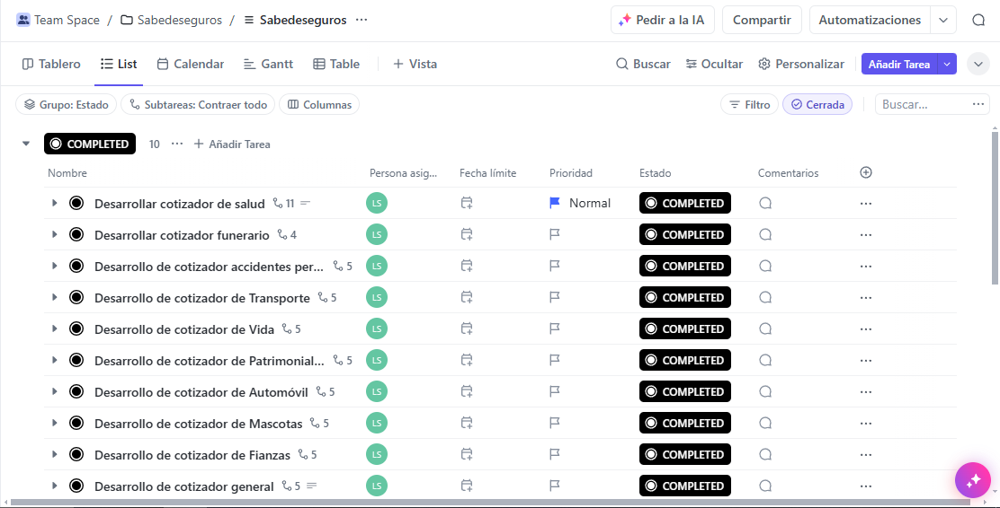

# SabedeSeguros App

Aplicación de cotizadores de pólizas de seguros para la página web de Sabe de Seguros que utiliza Vue.js y Vuetify, con una estructura de proyecto creada mediante su herramienta oficial de "scaffolding". Está diseñada para utilizarse en el contexto de un plugin personalizado de WordPress llamado [sabedese-quoters](https://github.com/luisjose1010/sabedese-quoters "sabedese-quoters"), del cuál consume los datos proporcionados por medio de la [REST API de WordPress](https://developer.wordpress.org/rest-api/ "REST API de WordPress").

## 💿 Instalación

Configura el proyecto usando el comando correspondiente para instalar las dependencias:

`npm install`

### Configuración de entorno local

Para configurar las variables de entorno necesarias de NodeJS se utiliza el archivo `.env.local` en la raíz del proyecto, mediante las variables de entorno necesarias que configuran a Vite, las cuales deben llevar el prefijo "VITE_" para ser reconocidas correctamente. El archivo `.env.local.example` es un ejemplo de la estructura del archivo `.env.local`, el cual contiene por defecto los valores requeridos para conectarse a la API que ofrece el plugin sobre el cual se diseñó la aplicación.

## 💡 Desarrollo

Esta sección cubre cómo iniciar el servidor de desarrollo y construir el proyecto para producción.

### Iniciando el servidor de desarrollo

Para iniciar el servidor de desarrollo con recarga instantánea, ejecuta el siguiente comando. El servidor será accesible en [http://localhost:3000](http://localhost:3000).

```bash
npm run dev
```

> Agregue NODE_OPTIONS='--no-warnings' para suprimir las advertencias de importación de JSON que ocurren como parte del mapeo de importación de Vuetify. Si está en Node [v21.3.0](https://nodejs.org/en/blog/release/v21.3.0) o superior, puede cambiar esto a NODE_OPTIONS='--disable-warning=5401'. Si no le molesta la advertencia, puede eliminarla de su script de desarrollo package.json.

### Building para producción

Para compilar el proyecto para producción, ejecute el siguiente comando:

```bash
npm run build
```

## Uso

Al ser dirigido su uso dentro del plugin [sabedese-quoters](https://github.com/luisjose1010/sabedese-quoters "sabedese-quoters") puede utilizar el componente por defecto, montando la aplicación normal de Vue en un elemento HTML con el id 'app' ubicado en cualquier lugar de un sitio web, o bien, utilizar cualquiera de los cotizadores individualmente mediante un elemento con el id 'sabedese-app', especificando el cotizador manualmente con su elemento.

Por ejemplo:

```html
<div id="app">
  <!-- Va a renderizar 'dropdown-quoters' automáticamente -->
</div>
```

o bien, para montar individualmente cada cotizador, utilizando el componente correspondiente, sería:

```html
<div id="sabedese-app">
  <dropdown-quoters></dropdown-quoters>
</div>
```

### Cotizadores disponibles

- **dropdown-quoters** - Cotizador desplegable con todo el resto de cotizadores.
- **health-quoter** - Cotizador para pólizas de salud.
- **funeral-quoter** - Cotizador para pólizas funerarias.
- **accidents-quoter** - Cotizador para pólizas de accidentes personales.
- **life-quoter** - Cotizador para pólizas de vida.
- **car-quoter** - Cotizador para pólizas de vehículos.
- **patrimonial-quoter** - Cotizador para pólizas patrimoniales.
- **transport-quoter** - Cotizador para pólizas de transporte.
- **surety-quoter** - Cotizador para pólizas de fianzas.
- **pet-quoter** - Cotizador para pólizas de mascotas.

### Uso dentro del plugin de WordPress

Para utilizar este componente en el [plugin](https://github.com/luisjose1010/sabedese-quoters "sabedese-quoters") de WordPress, se debe agregar todo el contenido de la carpeta resultante al [construir](#building-para-producción "Building") el proyecto para producción, llamada `/dist`, dentro de la carpeta `/src/app` del respectivo plugin, asegurándose de configurar correctamente el archivo de entorno [`.env.local`](#configuración-de-entorno-local "Configuración de entorno local") para permitir el acceso de los componentes a la API necesaria. El plugin se encuentra configurado para mostrar los componentes al utilizar los "shortcodes" definidos para cada cotizador.

## Gestión del proyecto

El proyecto se gestiona íntegramente mediante la plataforma de gestión [ClickUp](https://app.clickup.com/ "ClickUp") en este [enlace](https://app.clickup.com/9013166617/v/f/90131438783/90130724656 "Proyecto ClickUp de SabedeSeguros"). Para acceder al respectivo enlace con las tareas y la organización del proyecto, que complementan la documentación del mismo, es necesario poseer una cuenta con los permisos requeridos.



## ✨ Features

Aunque se indican las herramientas por defecto, mencionadas a continuación, hay que considerar que se deshabilitó la importación automática de los componentes y el "Routing" por defecto del proyecto, para utilizar utilizar el "router" procedente del proyecto antes de migrar a Vite con el scaffolding oficial de Vuetify.

- 🖼️ **Optimized Front-End Stack**: Aproveche las últimas versiones de Vue 3 y Vuetify 3 para disfrutar de una experiencia de desarrollo de interfaz de usuario moderna y reactiva. [Vue 3](https://v3.vuejs.org/) | [Vuetify 3](https://vuetifyjs.com/en/)
- 🚦 **Routing and Layouts**: Utiliza Vue Router para la navegación SPA y vite-plugin-vue-layouts para organizar diseños de archivos Vue. [Vue Router](https://router.vuejs.org/) | [vite-plugin-vue-layouts](https://github.com/JohnCampionJr/vite-plugin-vue-layouts)
- ⚡ **Next-Gen Tooling**: Con tecnología Vite, experimente arranques en frío rápidos y HMR (reemplazo de módulo caliente) instantáneo. [Vite](https://vitejs.dev/)
- 🧩 **Automated Component Importing**: Optimice su flujo de trabajo con unplugin-vue-components, importando componentes automáticamente a medida que los utiliza. [unplugin-vue-components](https://github.com/antfu/unplugin-vue-components)

## ❗️ Enlaces importantes

- [Proyecto Back-end (sabedese-quoters)](https://github.com/luisjose1010/sabedese-quoters "sabedese-quoters")
- 📄 [Docs](https://vuetifyjs.com/)
- 🚨 [Issues](https://issues.vuetifyjs.com/)
- 🏬 [Store](https://store.vuetifyjs.com/)
- 🎮 [Playground](https://play.vuetifyjs.com/)
- 💬 [Discord](https://community.vuetifyjs.com)
